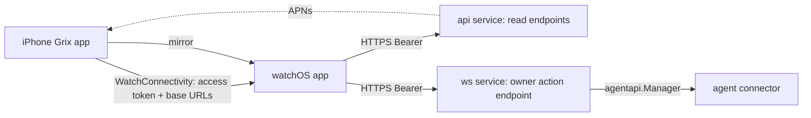

# Apple Watch companion for Grix

State: implemented (Phase 1). Owner: architecture. Phase 2 remains out of scope; see the section below.

## Context

Grix users run long agent tasks and are frequently blocked on three owner actions: approve/deny a permission request, answer an agent question, or stop a run. Today these arrive as APNs pushes with action buttons (categories `APPROVAL_REQUEST` and `AGENT_QUESTION`, registered in `frontend/ios/Runner/AppDelegate.swift`) and a one-time `action_token` that the phone POSTs to `/v1/notify-callback` on the ws service.

Constraints that shape the design:

- Flutter has no watchOS target. Any watch UI is a native SwiftUI target inside `frontend/ios`.
- The only process that can approve/deny/stop/reply is the ws service, because `agentapi.Manager` owns agent connections (`backend/internal/ws/notify_callback.go`). The api service cannot execute owner actions.
- Action tokens are single-use, short-lived, and exist only inside the push payload. There is no server list of "pending owner actions"; the durable state is `chat_states` (`SessionAgentState`, one row per session/owner, states `running | waiting_approval | waiting_question | completed | failed | idle`, plus `task_title`, `agent_id`, `last_run_id`).
- Owner chat messages are sent over the user WebSocket; there is no REST "send message" endpoint.
- Refresh tokens rotate per use with family revocation on reuse (`internal/api/service/auth_service.go` `RefreshToken`). Access TTL 2h, refresh TTL 7d (`backend/config.yaml`). Two devices sharing one refresh token would log each other out.

## Decision

The watch is for clearing owner blockers without taking the phone out. Scope is deliberately narrow: approvals, questions, stop, a glance at agent state, and a dictated one-shot instruction. No chat history, markdown, files, groups, settings, billing, or login on the watch.

### Phase 0 — mirrored notifications (no code)

iOS notifications mirror to Apple Watch with the category's action buttons; text-input actions use dictation/scribble. The action response is delivered to the iPhone app, which POSTs `/v1/notify-callback` exactly as today. Phase 0 is validation only; see Verification.

Guardrails that must stay true for Phase 0 to keep working:

- The `NotificationService` extension must not drop `category`, `action_token`, or `mutable-content` from the payload.
- Action identifiers `approve | deny | stop | reply` and the two category identifiers are a cross-component contract between `internal/notification/dispatcher.go` (`categoryFor`) and `AppDelegate.swift`. Do not rename either side alone.

### Phase 1 — native watchOS app (minimum viable)

Features, in priority order:

1. **Inbox**: sessions whose chat state is `waiting_approval` or `waiting_question`, with agent name and `task_title`; actions approve / deny / stop / reply (dictation).
2. **Agents**: owner's agents with online flag and current chat state summary (running / waiting / completed / failed / idle), derived from `chat_states` joined to the agent list.
3. **Quick send**: pick an agent's latest session, dictate text, send as the owner. Show the last agent text reply, truncated, plain text.
4. **Complication / Smart Stack widget**: `pending` count and `running` count; tap opens Inbox.

Architecture:

- **Auth**: the phone pushes the current access token (never the refresh token) plus API/ws base URLs to the watch via `WCSession.updateApplicationContext` every time it logs in or refreshes. The watch stores it in its own keychain and never calls `/v1/auth/refresh`. On 401 the watch shows "open Grix on your iPhone to re-sync". This keeps one refresh family per phone and costs nothing server-side; the watch works away from the phone for up to the access TTL (2h) after the last sync.
- **Transport**: the watch calls the backend directly over HTTPS so it works on cellular/Wi-Fi without the phone. No WebSocket on the watch; the watch polls on foreground/refresh and relies on mirrored pushes for wake-ups.
- **New read endpoints (api service, existing `middleware.Auth()`)**:
  - `GET /v1/chat_states/list` — all `chat_states` rows for the caller as owner, each with `session_id, agent_id, agent_name, state, task_title, last_run_id, updated_at`, plus the agent's online flag. One call feeds Inbox, Agents, and the complication. Add `?state=waiting` to restrict to `waiting_approval|waiting_question`; any other value is `400`. Newest first, capped at 200 rows.
  - The response also carries `agent_provider_type`. Presence is reported by the connector only, so a remote-model agent (`provider_type=1`) is permanently `agent_online=false`; without the provider type the watch would render every such agent as offline and send users chasing a connection that does not exist. Rows whose agent has been deleted are omitted — no owner action on them can succeed.
- **New write endpoint (ws service, next to `/v1/notify-callback`)**:
  - `POST /v1/owner-action` with `Authorization: Bearer <access token>` and body `{session_id, action, text?}`, `action ∈ approve | deny | stop | reply | send`. The handler loads the caller's `chat_states` row for `session_id`, resolves the current `approval_command_id` / question target from the pending blocker record, and executes through the same `executeNotifyAction` paths as the notify callback. `send` dispatches an owner chat message into the session; it must persist and render on the phone exactly like a WebSocket send, so it calls `handler.HandleSendMsg` — the very function the user WebSocket routes `send_msg` to — through a detached `ConnInterface` that carries the caller's identity and captures the ack, not `DispatchOwnerCommandText` alone (that path is a command relay and does not persist).
  - Owner-only: reject when `chat_states.owner_id != caller`. Rate limit per user like the notify callback. Return `409` when the action no longer applies so the watch can drop a stale item.

  As implemented, staleness is per action rather than one blanket rule, because the states differ in what they permit:

  - `approve` / `deny` require `waiting_approval`; `reply` requires `waiting_question`. A mismatch is `409`.
  - `stop` requires only a non-terminal state — a run can be stopped while it is merely `running`.
  - `send` has no state requirement; quick send is not an inbox action.

  There is also a second staleness signal. `chat_states` stays in `waiting_approval` until the run itself ends, so a phone approval is invisible in that column. The handler therefore also checks the approval card index (`im:agent_api:approval_card:*`, deleted the moment the card is edited with its result) and returns `409` when the decision is already made. It fails open when Redis is unavailable: relaying a duplicate `/approve`, which the agent ignores, is cheaper than refusing a real one.

  **Pending blocker record.** Action tokens carry the target inside the push payload; the watch has no token, so the server needs its own record of what a blocked session is blocked *on*. `agentapi.SavePendingOwnerBlocker` writes `{kind, agent_id, approval_command_id | question_id + question_message_id, run_id}` to `im:agent_api:pending_owner_blocker:<owner>:<session>` (48h TTL, same lifetime as the approval card index) at the two points that already publish the notification and flip `chat_states` into a waiting phase. No schema change; a newer card overwrites the older record, which matches "a session is blocked on at most one thing".
- **Watch target**: `GrixWatch` (watchOS app, bundle id `pub.dhf.grix.watchkitapp`) and `GrixWatchWidget` (WidgetKit, `pub.dhf.grix.watchkitapp.widget`) in `frontend/ios/Runner.xcworkspace`, SwiftUI, Swift Concurrency, no third-party dependencies, `WATCHOS_DEPLOYMENT_TARGET = 10.0` (`containerBackground` and the Smart Stack both need watchOS 10). They build from `Flutter/Watch.xcconfig`, which includes only `Generated.xcconfig` — it supplies `FLUTTER_BUILD_NAME`/`NUMBER` so the watch version tracks the app, and deliberately omits the Pods xcconfig, whose iOS framework search paths do not apply to watchOS. `GrixWatch` is a target dependency of `Runner` and is copied in by an "Embed Watch Content" phase; the widget is embedded into the watch app the same way.
- **Complication data**: the watch app writes `pending` / `running` counts into the `group.pub.dhf.grix.watch` App Group after every refresh and calls `WidgetCenter.reloadAllTimelines()`. The extension only reads those two integers and never touches the network, so the access token stays in the watch app's own keychain and out of the shared container. The App Group must be registered for the two watch bundle ids before a signed device build or archive; simulator builds do not need it.
- The Flutter side calls one MethodChannel (`pub.dhf.grix/watch_session`) from `AuthService._persistTokens` — the single funnel for both login and refresh — and again on logout to clear the watch. Native forwards to `WCSession.updateApplicationContext`.
- **Release**: no release-script change was needed. `release-frontend.sh ios` runs `flutter build ipa` on the `Runner` scheme, and the target dependency plus embed phase carry both watch targets into the archive (`flutter build ios` prints "Watch companion app found"). App Store Connect needs watchOS screenshots on first submission, and the two new bundle ids plus the App Group need provisioning before a signed build.

### Phase 2 — deferred, not in scope

- Live Activity for "agent running" (ActivityKit push tokens on the backend). Also appears in watchOS 11+ Smart Stack for free.
- Walkie-talkie voice: dictate → send → read the reply with `AVSpeechSynthesizer`. LiveKit has no watchOS SDK, so no real-time call.

## Alternatives

- **Relay everything through the iPhone over WatchConnectivity** and reuse the phone's WebSocket. Rejected: the watch becomes useless the moment the phone is out of Bluetooth range, which is the main reason to look at a watch.
- **Share the refresh token with the watch**. Rejected: rotation with family revocation means one device's refresh invalidates the other's session. A dedicated watch refresh family (phone mints a child refresh token for the watch device) is a clean follow-up if the 2h window proves too short; it needs a new auth endpoint and device record, so it is deferred.
- **Reuse `/v1/notify-callback` from the watch** by minting a token on demand. Rejected: tokens are single-use and bound to one notification event; the Inbox needs to act on the current state, not on a past push.
- **WebSocket on the watch**. Rejected for Phase 1: watchOS background networking is restricted, and mirrored pushes plus on-foreground polling are enough for an inbox.

## Consequences

- One new read endpoint on the api service and one authenticated write endpoint on the ws service. No schema change; `chat_states` already carries what the watch needs.
- The ws service gains a second entry point that executes owner actions; it must enforce ownership and rate limits as strictly as the notify callback.
- The iOS build grows two native targets; CI and the release script must build them, and Sentry/dSYM handling should include them.
- Cross-client contract: `chat_states` state names are now consumed by three clients (Flutter, connector MCP `grix_chat_state_query`, watch). Renaming a state requires touching all three.
- `notification.BuildClaims` and the `ownerActionExecutor` interface around `executeNotifyAction` are exported/extracted so a test can prove both entry points emit the same agent command. Keep them that way: the parity test is the only thing standing between the two paths drifting apart.
- The ws service now authenticates access tokens itself (`authenticateBearer` in `internal/ws/owner_action.go`) because it is plain `net/http` and cannot use the gin `middleware.Auth()`. The two must stay in step — revocation, password-change invalidation and the disabled-user check are duplicated there deliberately.

## Verification

Phase 0 (manual, needs a paired Apple Watch, iPhone locked):

1. An agent requests approval → the watch shows the notification with Approve / Deny / Stop task.
2. Tap Approve → `/v1/notify-callback` logs `action=approve` and the agent continues.
3. An agent asks a question → tap Reply, dictate → the agent receives the text.
4. `.authenticationRequired` actions execute while the watch is unlocked on the wrist.

Phase 1, automated (all green):

- `backend/internal/ws/owner_action_test.go` — `owner-action` rejects an unauthenticated caller (401), a non-owner (403, never 404), an unknown action and an empty session id (400), a terminal or mismatched waiting state (409), an approval already settled on the phone (409), and enforces the per-user rate limit while leaving a second owner's budget untouched.
- `backend/internal/ws/owner_action_test.go` — parity: for one pending approval, the claims rebuilt from `chat_states` + blocker match the claims signed into the push action token, and running both through `executeNotifyAction` emits the identical `/approve <id> allow` command to the same agent.
- `backend/internal/api/handler/chat_state_test.go` — `chat_states/list` returns only the caller's rows, honors `state=waiting`, rejects any other filter value, orders newest first, omits deleted agents, and reports `agent_provider_type`.
- Watch build: `xcodebuild -target GrixWatch -sdk watchsimulator` builds both watch targets; `flutter build ios --release` and `xcodebuild archive` on the `Runner` scheme both produce `Grix.app/Watch/GrixWatch.app/PlugIns/GrixWatchWidget.appex`.

Phase 1, still manual (needs a paired Apple Watch and a signed build):

- With Bluetooth off on the phone, the Inbox loads and an approval succeeds; after the phone resolves an item, the watch drops it on the next refresh; complication counts equal Inbox length.
- `release-frontend.sh ios` uploads the watch targets with the iOS app under real signing.
