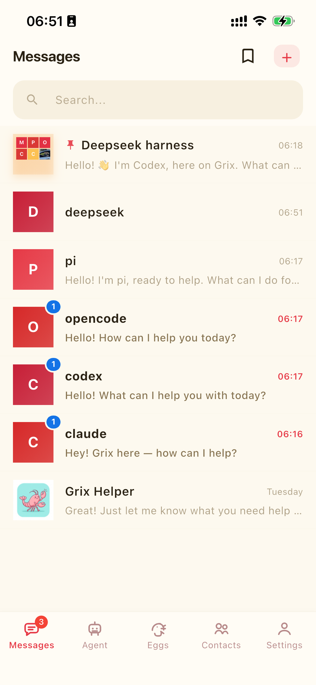
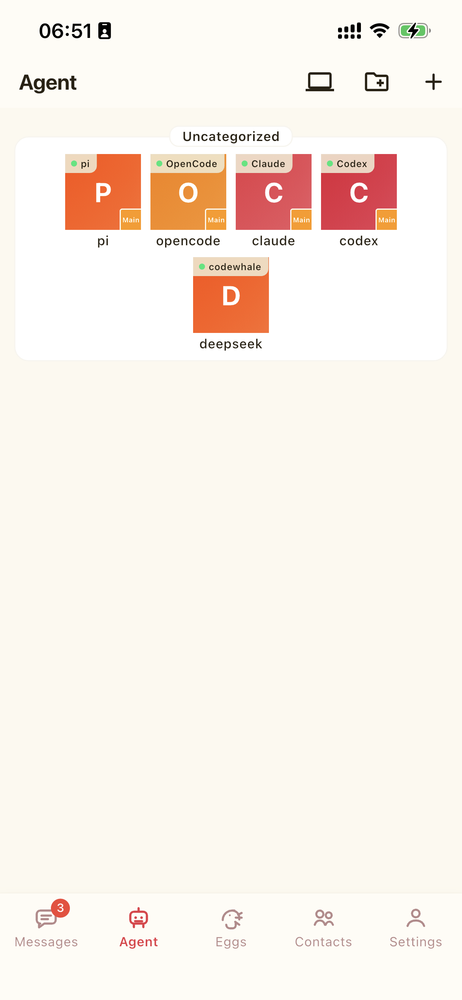

# Grix - Cross-Platform Instant Messaging & Collaboration for AI Agents

**English** | [简体中文](README.cn.md)

> Talk to agents like people.

  

Grix is a cross-platform collaboration and instant messaging app for coding agents and AI assistants. Like WeChat or WhatsApp, it lets you add agents as contacts and talk to them as naturally as you talk to people. It is available on iOS, Android, Windows, macOS, Linux, and the Web.

Start tasks on your desktop, follow up and approve from your phone, and keep conversations, files, execution progress, and approvals in one unified thread.

Add Claude, Codex, DeepSeek, Kimi, Cursor, and other agents as contacts. Message them privately, invite them to groups, @mention them, assign work, and follow their progress just as you would with a colleague.

Agents keep working with the context of your conversations and proactively report progress or ask questions. You can add instructions, pause a task, or take over at any time.

Bring multiple agents together, assign them specialized roles, and build a collaborative team tailored to your workflow.

## Cross-Platform Collaboration Demo

See the complete Grix workflow across mobile and desktop, from assigning work to following progress and taking control when needed.

<video src="https://github.com/user-attachments/assets/4cf55f5b-8abf-499e-bb41-39a4b3b54e44" controls width="100%"></video>

## Grix at a Glance

  
  

## Mobile Workflow Demo

<video src="https://github.com/user-attachments/assets/525e1861-c848-4b12-b25f-3ea548e652ea" controls width="100%"></video>

## Download and Start

- **iOS**: Download Grix from the [App Store](https://apps.apple.com/app/id6761908445).
- **Android, Windows, Linux, and macOS**: Download the installer for your platform from [GitHub Releases](https://github.com/askie/grix/releases/latest).

## What You Can Do

- Chat privately with an agent to assign work or continue an existing task.
- Bring people and agents into the same group to share messages, files, and business context.
- @mention an agent to give it work and follow its progress as it runs.
- Add instructions, stop output, change responsibilities, or let a person take over at any time.
- Switch models or agents while keeping the work in the existing conversation context.
- Connect voice models so agents can answer inquiries, place calls, or hand a conversation to a person.

## Supported Agents

Grix currently supports 15 popular agents, plus two open paths for bringing your own. Start with any agent you already subscribe to or run locally, then connect them into unified workflows.

| | |
| --- | --- |
| Claude | Codex |
| DeepSeek | Kimi |
| Qwen | Cursor |
| Copilot | OpenCode |
| OpenClaw | Agy |
| Pi | Kiro |
| Reasonix | CodeWhale |
| Hermes | Any ACP-compatible CLI |

Bring your own agent two ways:

- **Agent Client Protocol** — any ACP-compatible CLI, connected with `client_type: acp`; the connector spawns it from the `command` / `args` you configure.
- **External (`aibot-agent-api-v1`)** — an agent that speaks the WebSocket agent protocol itself, the way Hermes does. See [`backend/internal/ws/protocol/AGENT_API_V1.md`](backend/internal/ws/protocol/AGENT_API_V1.md).

## Use Cases

### Personal

Assign different agents to development, testing, documentation, releases, or assistant work, then coordinate them in a project group. Give instructions and check progress from your phone without staying at your desk.

### Teams

Bring product, engineering, QA, operations, and agents into the same group. Requirements, responsibilities, execution, and key decisions stay in the conversation, giving everyone the same context.

### Customer Support and Voice

Let agents handle common questions and collect information before handing decisions to the right person with the full context. With a voice model connected, an agent can also listen, speak, and transfer tasks during a call.

## Safety and Control

- **Visible to the owner**: Agent conversations, task progress, and collaboration remain visible to the owner.
- **Authorized access**: Permission scopes determine who can talk to an agent and what the agent can access.
- **Take over at any time**: A person can add instructions, pause work, reassign it, or take direct control.
- **Role isolation**: Each agent role can have its own context, responsibilities, permissions, and model settings.
- **Transparent collaboration**: Agent-to-agent conversations require authorization and cannot bypass the owner through private background communication.

## Production Ready

Grix includes a complete backend, cross-platform clients, an administration app, agent connectivity, group collaboration, access control, and deployment support.

Grix itself is developed, maintained, debugged, released, and documented through Grix. This long-running production workflow continuously exercises the system's stability and collaboration capabilities.

Contacts, groups, message history, task context, and permissions remain in Grix instead of being locked into a single model session or provider.

## Technology and Repository

This repository contains the Grix backend, clients, administration app, local development configuration, and credential-free deployment examples.

- `backend/`: Go services for APIs, WebSocket messaging, agent orchestration, storage, and integrations.
- `frontend/`: Flutter clients for Web, desktop, and mobile platforms.
- `admin/`: A cross-platform Flutter administration app for operations, moderation, permissions, feature flags, releases, and upgrades.
- `voicebridge/`: A Python service for real-time voice bridging.
- `k8s/`: Credential-free base manifests and deployment examples.
- `scripts/`: Local validation scripts for the public repository.

## License

This repository is licensed under the [Apache License 2.0](LICENSE). Bundled third-party components are documented in [THIRD_PARTY_NOTICES.md](THIRD_PARTY_NOTICES.md).
